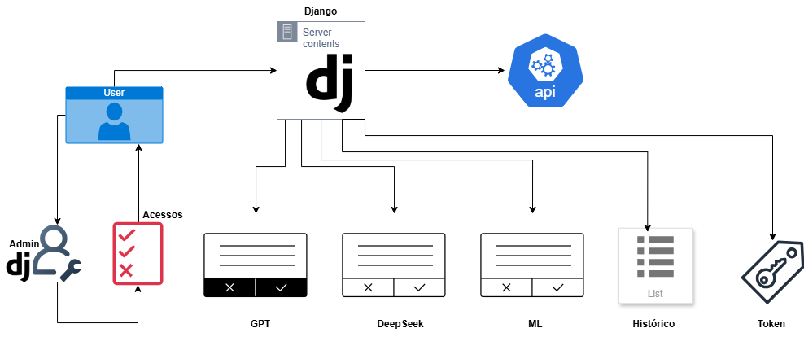

# Pós Agentes Inteligentes - INF0236 - FRAMEWORK DE DESENVOLVIMENTO WEB e INF0241 - CONSTRUÇÃO DE APIS PARA INTELIGÊNCIA ARTIFICIAL


Repositório dedicado para desenvolvimentos dos trabalhos finais nas disciplinas INF0236 - FRAMEWORK DE DESENVOLVIMENTO WEB P/ CONSUMO DE MODELOS TREI. INTELIGÊNCIA ARTIFICIAL e INF0241 - CONSTRUÇÃO DE APIS PARA INTELIGÊNCIA ARTIFICIAL, da pós graduação de Agentes Inteligentes da UNIVERSIDADE FEDERAL DE GOIÁS.

Integrantes: Marcos Vinicius, Pedro Koziel e Wagner Filho.

## Descrição do projeto final (INF0236)

Construir um site, aplicação (web/internet - Django), de forma que haja (i) carregamento de dados (ex: csv, excel, etc.), (ii) uso de algoritmo de IA, e (iii) mostrar os resultados em tela.

- Implementação de algoritmos de classificação de sentimentos utilizando modelos baseados em aprendizado de máquina e API da OpenAI para classificação dos textos.
          
- Otimização de hiperparâmetros e testes com diferentes modelos de machine learning.
          
- Desenvolvimento de uma interface para interação com os modelos e visualização dos resultados.
          
- Criação de um banco de dados para armazenar e gerenciar o histórico de análises realizadas.


## Descrição do Projeto Final (INF0241)

Desenvolver uma API funcional que disponibilize pelo menos dois serviços de Inteligência Artificial (IA), demonstrando na prática todos os conceitos aprendidos ao longo da disciplina: boas práticas de desenvolvimento, versionamento, autenticação, documentação, logs, tratamento de erros, entre outros.

**Requisitos Básicos**

- a. Validação de dados  
- b. Tratamento de erros  
- c. Logs  
- d. Segurança  
- e. Versionamento  


# Como executar


Siga as instruções abaixo para garantir uma instalação e execução corretas.
Além disso, os projetos estao separados em dois frameworks diferentes: Django e FastAPI.
Caso queira executar a Django siga o passo a passo, ou caso queira executar com FastAPI, entre na pasta fastapi e siga as recomendações.

---

## **1. Requisitos do Sistema**

Certifique-se de que os seguintes componentes estejam instalados no sistema:

- **Python 3.9 ou superior**
- **pip** (gerenciador de pacotes do Python)
- **Virtualenv** (opcional, mas recomendado para isolar o ambiente do projeto)
---

## **2. Configuração do Ambiente**

### **Passo 1: Clonar o Repositório**

Clone o repositório do projeto para sua máquina local:
```bash
git clone <URL_DO_REPOSITORIO>
cd <NOME_DO_DIRETORIO>
```

### **Passo 2: Criar e Ativar um Ambiente Virtual**

Crie um ambiente virtual para o projeto:
```bash
python3 -m venv venv
ou
python -m venv venv
```

Ative o ambiente virtual:
- No Linux/Mac:
  ```bash
  source venv/bin/activate
  ```
- No Windows:
  ```bash
  venv\Scripts\activate
  ou
  cd .\venv\Scripts\
  .\activate.ps1
  ```

### **Passo 3: Instalar Dependências**

Instale as dependências listadas no arquivo `requirements.txt`:
```bash
pip install -r requirements.txt
```

---

## **3. Criar um Superusuário**

Crie as tabelas no banco de dados:
```bash
cd .\sentiment_service\  
python manage.py migrate
```

Crie um superusuário para acessar a área administrativa do Django:
```bash
python manage.py createsuperuser
```
Durante o processo, você precisará fornecer as seguintes informações:
- Email
- Nome de usuário
- Nome e sobrenome
- Senha

---

## **4. Executar o Servidor de Desenvolvimento**

Inicie o servidor de desenvolvimento do Django:
```bash
python manage.py runserver
```

Acesse o projeto no navegador em: [http://127.0.0.1:8000/](http://127.0.0.1:8000/)

---

## **5. Acessar a Administração do Django**

Para acessar o painel administrativo, entre no seguinte link:
[http://127.0.0.1:8000/admin/](http://127.0.0.1:8000/admin/)

Use o usuario e a senha criados para o superusuário.

---

## **6. Acessar o Sentiment Service**
Clique em Criar Usuário na Tela de Login ou acesse o link:
http://localhost:8000/sentiment/cadastro/

Use o usuario e a senha criados no superusuário para acessar o Admin do Django e Liberar Permissões aos modelos.

## **7. Acessar o Sentiment API**
Obtendo chave API:
```
curl -X POST http://127.0.0.1:8000/api/v1/token/ \
     -H "Content-Type: application/json" \
     --data-binary '{
         "usuario": "meu_usuario",
         "senha": "minha_senha"
     }'
```
Acessando modelos de ML:
```
curl -X POST http://127.0.0.1:8000/api/v1/predict-sentiment/ \
     -H "Content-Type: application/json" \
     -H "Authorization: SEU_TOKEN_USUARIO" \
     --data-binary '{
         "text": "Esse produto é excelente, adorei a experiência!", 
         "models": ["KNN", "LinearSVC", "LogisticRegression", "MultinomialNB", "RandomForest"]
     }'
```
Acessando modelo de GPT
```
curl -X POST http://127.0.0.1:8000/api/v1/predict-sentiment/ \
     -H "Content-Type: application/json" \
     -H "Authorization: SEU_TOKEN_USUARIO" \
     --data-binary '{"text": "Estou muito feliz hoje!", "models": ["GPT"]}'
```
Acessando modelo de DeepSeek
```
curl -X POST http://127.0.0.1:8000/api/v1/predict-sentiment/ \
     -H "Content-Type: application/json" \
     -H "Authorization: SEU_TOKEN_USUARIO" \
     --data-binary '{"text": "Estou muito feliz hoje!", "models": ["DeepSeek"]}'
```
Acessando modelo de Conectando Diferentes Modelos
```
curl -X POST http://127.0.0.1:8000/api/v1/predict-sentiment/ \
     -H "Content-Type: application/json" \
     -H "Authorization: SEU_TOKEN_USUARIO" \
     --data-binary '{
         "text": "Esse produto é excelente, adorei a experiência!", 
         "models": ["KNN", "LinearSVC", "LogisticRegression", "MultinomialNB", "RandomForest","GPT"]
     }'  
```
